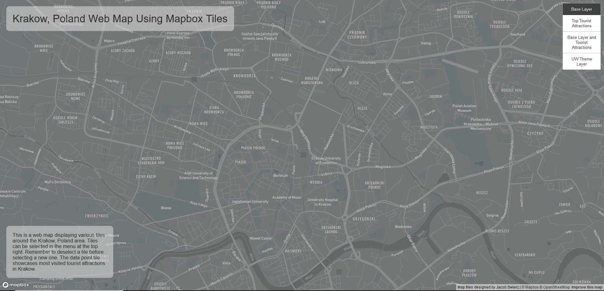

# GEOG 458 Lab 4: Map Design and Tile Generation

## Web Map URL
https://swierj.github.io/geog458_lab4/index.html

## Examined Geographic Area
For my web map I decided to examine Krakow, Poland (and some surrounding areas) as the geographic area. Reasoning being that I am Polish and love visiting this city. In particular I focused on the most popular tourist attractions.

The available zoom levels on all tile sets is 1-14 (min zoom: 1 and max zoom: 14).

## Tile Set 1: Base Map

This is a monochrome color scheme basemap made on mapbox. It uses a darker gray color and a combination of the DIN Pro font family and Oswald font family.

## Tile Set 2: Thematic Layer of Top Tourist Attractions

This is a thematic layer on top of a default light basemap provided by mapbox. The data point represent the coordinates of top tourist attractions in Krakow, Poland and each of them is labeled. I chose to use red dots for good contrast with the basemap so that they easily stand out to the viewer. If the user zooms out they will find a few more points outside of the city. The data I used for this was created by me after researching the most popular attractions and finding their coordinate points via google maps.

## Tile Set 3: Thematic Layer of Top Tourist Attractions on Base Map

This is a combination of the thematic layer from tile set 2, using those data points, plotted over the monochrome basemap from tile set 1.

## Tile Set 4: UW Theme Map Layer

This is a theme map layer using the University of Washington theme. For this map layer I researched the [colors](https://www.washington.edu/brand/graphic-elements/primary-color-palette/) and [fonts](https://www.washington.edu/brand/graphic-elements/font-download/) that the UW uses and imported them into mapbox to create this theme. I left certain things like bodies of water their original blue color, but most terrain was changed to the husky purple. The husky gold was used for labels, transits, road networks, etc. as seen in the screenshot.

## Acknowledgements
Code used in [main page](index.html) partially taken from Professor Zhao's lab 4 example/instructions found [here](https://github.com/jakobzhao/geog458/tree/master/labs/lab04). Map tiles in this assignment were made using Mapbox and QGIS.
